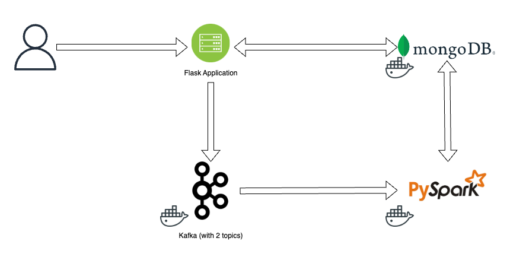
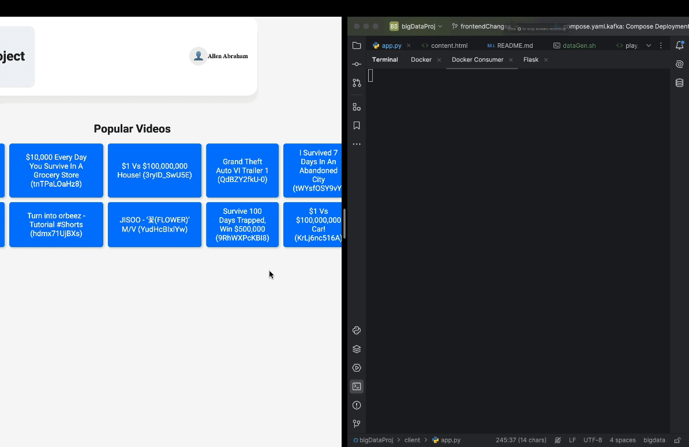

# BigData Project

[Link to Project Report](assets/BigdataReport.pdf)

# Result

### *Architecture Diagram*


---
### *Logs being generated to Kafka when a user clicks on a video*


---
### *Logs being generated to Kafka when a user clicks on a video*


## Running the cluster
Just run `docker compose up -d` in the project's root folder

### Kafka
#### Connection to Kafka Producer and Consumer
**To exec into the Kafka conatiner:**

`docker-compose exec kafka bash`

**Push messages to the *vidRecommender* Topic using Internal libraries:**

```bash
kafka-console-producer.sh
    --producer.config /opt/bitnami/kafka/config/producer.properties
    --bootstrap-server kafka:9092
    --topic vidRecommender
```


```bash
kafka-console-consumer.sh
    --consumer.config /opt/bitnami/kafka/config/consumer.properties
    --bootstrap-server kafka:9092
    --from-beginning
    --topic vidRecommender
```

### Mongodb

Run `docker exec -it mongo bash` to interact with mongo on terminal

To access mongoshell use `mongosh`

#### Setting up data

>First run commands in `temp.sh` or run the given commands in the terminal

```bash
conda create -n bigdata python==3.10
conda activate bigdata
pip install jupyter
pip install pandas
pip install numpy
pip install pymongo
pip install py7zr
```

Use `jupyter notebook` command in bigdata env in the terminal and run all cell of `mongosetup.ipynb`

**NOTE**: Run all the cell only ONCE

Make sure that you use `docker compose stop` rather than `docker compose down`

